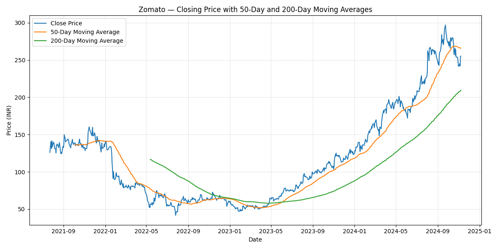
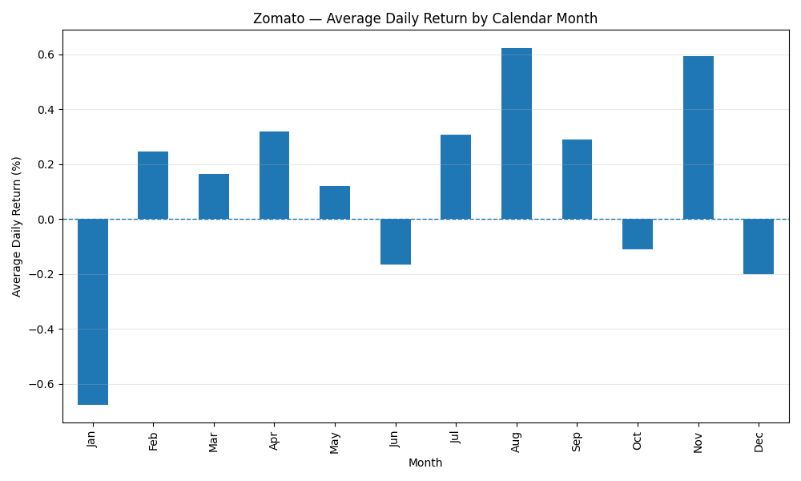
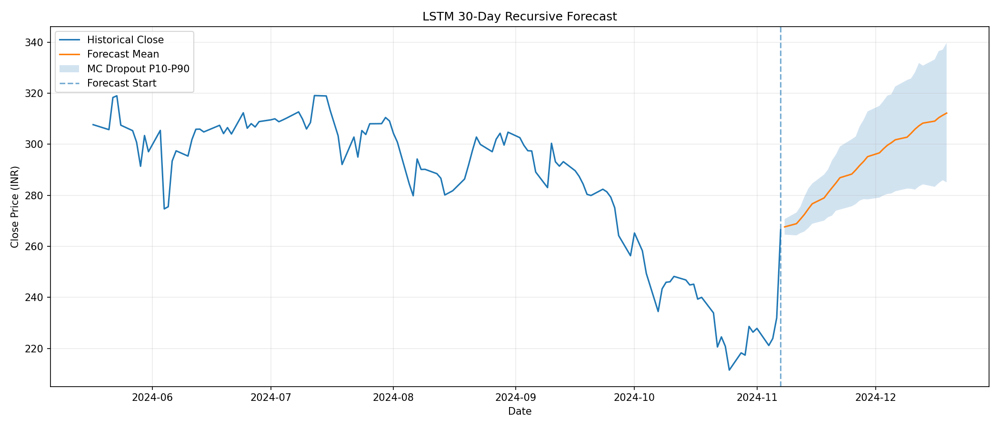

# Zomato Stock Analysis & LSTM Forecasting

> **License & Usage Notice:** This repository is proprietary and is provided
> for educational and research viewing only. Financial, investment, trading,
> commercial, redistribution, and derivative use is not permitted without
> prior written permission. See [`LICENSE`](LICENSE) for the complete terms.

An end-to-end financial time-series analysis and forecasting project using historical Zomato Limited stock data from the National Stock Exchange of India (NSE).

The project is divided into three phases:

- **Phase 0 — Data Acquisition**
- **Phase 1 — Exploratory Data Analysis**
- **Phase 2 — LSTM Forecasting & Model Evaluation**

The project focuses not only on generating a future stock forecast, but also on evaluating whether the forecasting model provides meaningful predictive value compared with a simple baseline.

---

## Project Pipeline

```text
                    ZOMATO.NS
                        │
                        ▼
             ┌─────────────────────┐
             │       PHASE 0       │
             │  Data Acquisition   │
             │                     │
             │     yfinance        │
             │   Yahoo Finance     │
             └──────────┬──────────┘
                        │
                        ▼
             ┌─────────────────────┐
             │       PHASE 1       │
             │ Exploratory Data    │
             │      Analysis       │
             │                     │
             │ • Price trends      │
             │ • Daily returns     │
             │ • Volatility        │
             │ • Moving averages   │
             │ • Yearly performance│
             │ • Monthly returns   │
             │ • Seasonal patterns │
             └──────────┬──────────┘
                        │
                        ▼
             ┌─────────────────────┐
             │       PHASE 2       │
             │ LSTM Forecasting     │
             │                     │
             │ • Walk-forward test │
             │ • Naive baseline    │
             │ • LSTM evaluation   │
             │ • 30-day forecast   │
             │ • MC Dropout        │
             │ • Reliability check │
             │ • Model signal      │
             └─────────────────────┘
```

---

# Phase 0 — Data Acquisition

Historical Zomato stock data is retrieved from Yahoo Finance using `yfinance`.

The acquisition script:

- Downloads approximately five years of historical data
- Uses the NSE ticker `ZOMATO.NS`
- Checks whether data was successfully retrieved
- Saves the resulting dataset as a CSV file

### Input

```text
ZOMATO.NS
```

### Output

```text
ZOMATO.NS_5year_history.csv
```

The generated CSV dataset is then used by Phase 1 and Phase 2.

---

# Phase 1 — Exploratory Data Analysis

Phase 1 examines the historical behavior of Zomato stock before applying machine learning.

The analysis focuses on price trends, returns, volatility, moving averages, yearly performance, monthly performance, and possible calendar-based patterns.

## Analyses Performed

### 1. Historical Closing Price

The closing price is plotted over the available historical period to visualize long-term price movement.

### 2. Daily Returns

Daily percentage returns are calculated as:

```text
Daily Return = (Today's Close - Previous Close) / Previous Close
```

Daily returns provide a view of short-term price variability.

### 3. Historical Volatility

The standard deviation of daily returns is calculated as a simple measure of historical volatility.

### 4. Moving Averages

Two moving averages are calculated:

- 50-day moving average
- 200-day moving average

These are used to visualize medium- and long-term price trends.

### 5. Yearly Performance

The first and last available closing prices of each calendar year are used to calculate yearly price returns.

### 6. Monthly Returns

Monthly compounded returns are calculated from daily returns.

### 7. Monthly Return Heatmap

Monthly returns are displayed using a year-by-month heatmap to identify periods of relatively strong and weak performance.

### 8. Calendar-Based Analysis

Average closing prices are grouped by calendar month to explore potential seasonal patterns.

These analyses are exploratory and do not establish that observed patterns are statistically significant or predictive.

---

## Phase 1 Visualizations

### Historical Closing Price


### Daily Returns


### 50-Day vs 200-Day Moving Average



### Monthly Returns


### Average Return by Month



---

# Phase 2 — LSTM Forecasting

Phase 2 tests whether an LSTM neural network can provide useful out-of-sample forecasts.

The model is first evaluated using historical data through walk-forward backtesting and is then used to generate a 30-day recursive forecast.

---

## Model Architecture

The forecasting model consists of:

```text
Input
  │
  ▼
LSTM (64 units)
  │
  ▼
Dropout (20%)
  │
  ▼
LSTM (32 units)
  │
  ▼
Dropout (20%)
  │
  ▼
Dense (16, ReLU)
  │
  ▼
Dense (1)
  │
  ▼
Prediction
```

The model uses the previous **60 observations** as its input window.

---

## Walk-Forward Backtesting

The primary evaluation method is walk-forward backtesting.

Instead of randomly splitting the time series, the model is evaluated chronologically on a held-out test period.

For every test observation:

```text
Previous 60 observations
          │
          ▼
        LSTM
          │
          ▼
    Next-day prediction
          │
          ▼
Compare against actual value
```

The model does not feed its own predictions back into the input during this evaluation.

This provides a cleaner estimate of one-step-ahead out-of-sample performance.

---

## Naive Baseline

The LSTM is compared against a simple persistence model:

```text
Tomorrow's prediction = Today's value
```

This baseline is intentionally simple.

A forecasting model should demonstrate that it provides useful predictive information beyond simply assuming that the next value will remain close to the current value.

---

# Evaluation Metrics

The following metrics are used to evaluate the model.

## MAE — Mean Absolute Error

Measures the average absolute difference between predicted and actual values.

```text
MAE = mean(|actual - prediction|)
```

Lower is better.

## RMSE — Root Mean Squared Error

Penalizes larger prediction errors more strongly than MAE.

Lower is better.

## MAPE — Mean Absolute Percentage Error

Expresses prediction error as a percentage.

Lower is better.

## Directional Accuracy

Measures how often the model correctly predicts the direction of movement.

A value around 50% represents approximately random directional prediction.

---

# 30-Day Recursive Forecast

After backtesting, the final model is used to generate a 30-day forecast.

Unlike the one-step backtest, the recursive forecast feeds each prediction back into the next input window.

```text
Day 1
60 historical observations
          │
          ▼
      Prediction
          │
          ▼
Day 2
59 historical observations
+ Day 1 prediction
          │
          ▼
      Prediction
          │
          ▼
Day 3
58 historical observations
+ 2 predictions
          │
          ▼
         ...
```

This allows the model to generate a multi-day forecast, but prediction errors can compound as previous predictions are repeatedly fed back into the model.

---

# Monte-Carlo Dropout

A single recursive forecast can give a misleading impression of precision.

To estimate model uncertainty, the LSTM is evaluated multiple times with dropout enabled during inference.

The current configuration performs:

```text
100 Monte-Carlo passes
```

This produces a distribution of forecast paths rather than relying on a single deterministic forecast.

The final forecast reports:

- Mean forecast
- 10th percentile (P10)
- 90th percentile (P90)
- Probability of a positive outcome

The P10/P90 range is an empirical Monte-Carlo dropout distribution and should not be interpreted as a guaranteed statistical confidence interval.

---

# Model Signal

The project uses a reliability-aware decision rule.

```text
Expected 30-day return > +5%
        AND
Positive-outcome probability >= 65%
        AND
Historical model reliability is acceptable
        │
        ▼
       BUY

Otherwise
        │
        ▼
   HOLD / AVOID
```

The reliability check prevents a large predicted return from automatically becoming a BUY signal when historical model performance is weak.

---

# Phase 2 Results

The following results were obtained from the experiment using the dataset ending **2024-11-07**.

## Dataset

```text
Price observations: 815
Date range: 2021-07-23 → 2024-11-07
Test observations: 60
```

---

## LSTM vs Naive Baseline

| Metric | LSTM | Naive Baseline |
|---|---:|---:|
| RMSE | 6.2664 | 6.0419 |
| MAE | 5.0652 | 4.9250 |
| MAPE | 1.91% | 1.85% |
| Directional Accuracy | 41.7% | 51.7% |

### Relative Performance

```text
MAE improvement:  -2.85%
RMSE improvement: -3.71%
```

The negative improvement means the LSTM did **not** outperform the naive baseline on either MAE or RMSE.

The LSTM also achieved only **41.7% directional accuracy**, compared with **51.7%** for the naive baseline.

Therefore:

```text
Historical Model Reliability: LOW
```

---

# 30-Day Forecast Results

The final model produced the following forecast:

| Forecast Metric | Result |
|---|---:|
| Last actual close | ₹255.22 |
| Day-30 mean forecast | ₹315.04 |
| Expected 30-day return | +23.44% |
| P10 forecast | ₹248.23 |
| P10 return | -2.74% |
| P90 forecast | ₹377.87 |
| P90 return | +48.06% |
| Probability of positive outcome | 85.5% |
| Probability of negative outcome | 14.5% |

The forecast itself is strongly positive, with an expected 30-day return of **+23.44%**.

However, the uncertainty range is wide:

```text
P10 return: -2.74%
P90 return: +48.06%
```

This indicates substantial uncertainty around the forecast.

---

# Model Signal

The configured signal thresholds were:

```text
BUY threshold:                  +5.0%
Required positive probability:   65.0%
Historical model reliability:    LOW
```

Despite the forecast satisfying the return and probability thresholds:

```text
Expected return:               +23.44%
Positive-outcome probability:   85.5%
```

the final signal was:

```text
FINAL SIGNAL: HOLD / AVOID
```

---

# Why the Final Signal Is Not BUY

The model predicted:

```text
+23.44% expected return
85.5% probability of positive outcome
```

These values would normally appear to support a BUY signal.

However, the historical backtest showed:

```text
LSTM MAE > Naive MAE
LSTM RMSE > Naive RMSE
LSTM Directional Accuracy = 41.7%
```

The LSTM therefore failed to demonstrate that it could reliably outperform the simple persistence baseline.

The project consequently prioritizes **historical predictive reliability over the attractiveness of the future forecast**.

This prevents a visually attractive forecast from automatically being interpreted as evidence of a profitable trading strategy.

---

# Phase 2 Interpretation

The final experiment demonstrates an important distinction between:

```text
Forecast magnitude
        ≠
Predictive reliability
```

The LSTM produced a strongly positive forecast, but its historical out-of-sample performance was weaker than the naive baseline.

Therefore, the system deliberately produces:

```text
HOLD / AVOID
```

rather than treating the +23.44% forecast as a standalone trading recommendation.

The output also explicitly warns:

```text
Historical model performance is weak.
The 30-day forecast should not be treated as a reliable trading signal.
```

---

# Phase 2 Visualization

The Phase 2 script generates a forecast visualization containing:

- Recent historical closing prices
- Mean 30-day forecast
- P10 forecast
- P90 forecast
- Forecast uncertainty range



---

# Project Structure

```text
Stock-Prediction-FinTech/
│
├── phase0_data_acquisition.py
├── phase1_exploratory_analysis.py
├── phase2_lstm_forecasting.py
│
├── images/
│   ├── 50Day_vs_200Day_MA.png
│   ├── Avg_Return_ByMonth.png
│   ├── Daily Returns.png
│   ├── Historical Closing Price.png
│   ├── Monthly Return.png
│   └── lstm_forecast.png
│
├── requirements.txt
├── README.md
└── .gitignore
```

The raw CSV dataset is intentionally excluded from the repository and can be generated using Phase 0.

---

# Installation

## 1. Clone the Repository

```bash
git clone https://github.com/JayarthaSengupta/Stock-Prediction-FinTech.git
cd Stock-Prediction-FinTech
```

## 2. Create a Virtual Environment

On Windows:

```powershell
python -m venv venv
```

Activate it:

```powershell
.\venv\Scripts\Activate.ps1
```

## 3. Install Dependencies

```powershell
python -m pip install -r requirements.txt
```

---

# Usage

## Phase 0 — Data Acquisition

Run:

```powershell
python phase0_data_acquisition.py
```

This downloads approximately five years of historical Zomato stock data from Yahoo Finance and saves the resulting CSV file.

---

## Phase 1 — Exploratory Data Analysis

Run:

```powershell
python phase1_exploratory_analysis.py
```

This performs:

- Historical closing price analysis
- Daily return analysis
- Volatility calculation
- Moving-average analysis
- Yearly performance analysis
- Monthly return analysis
- Monthly return heatmap
- Calendar-based analysis

---

## Phase 2 — LSTM Forecasting

Run:

```powershell
python phase2_lstm_forecasting.py
```

The script performs:

1. Walk-forward backtesting
2. Naive baseline comparison
3. LSTM evaluation
4. Final model training
5. 30-day recursive forecasting
6. Monte-Carlo dropout simulation
7. Reliability assessment
8. BUY / HOLD / AVOID signal generation
9. Forecast visualization

---

# Configuration

Important Phase 2 parameters can be modified in the forecasting script.

```python
LOOKBACK = 60
FORECAST_HORIZON = 30
TEST_DAYS = 60
BUY_THRESHOLD = 5.0
MC_PASSES = 100
EPOCHS = 100
BATCH_SIZE = 32
```

## LOOKBACK

Number of historical observations used for each prediction.

Default:

```text
60 trading observations
```

## FORECAST_HORIZON

Number of future observations generated recursively.

Default:

```text
30 trading observations
```

## TEST_DAYS

Number of observations reserved for out-of-sample testing.

Default:

```text
60 observations
```

## BUY_THRESHOLD

Minimum expected return required before considering a BUY signal.

Default:

```text
+5%
```

## MC_PASSES

Number of Monte-Carlo dropout simulations.

Default:

```text
100
```

---

# Technical Stack

## Data Acquisition

- Python
- yfinance
- pandas
- Yahoo Finance

## Data Analysis

- pandas
- NumPy
- Matplotlib
- Seaborn

## Machine Learning

- TensorFlow
- Keras
- Scikit-learn

## Model

- Long Short-Term Memory (LSTM)
- Dropout
- Monte-Carlo Dropout

## Evaluation

- Walk-forward backtesting
- Mean Absolute Error
- Root Mean Squared Error
- Mean Absolute Percentage Error
- Directional Accuracy
- Naive persistence baseline

---

# Methodological Considerations

## No Random Train-Test Split

The project treats the data as a time series.

Randomly shuffling observations could allow information from the future to influence the training process.

The evaluation therefore preserves chronological ordering.

## Out-of-Sample Evaluation

The test period is kept separate from the model's training data.

This provides a more realistic estimate of predictive performance than evaluating the model on data it has already seen.

## Baseline Comparison

A model should not be considered useful simply because it produces predictions.

It should demonstrate value beyond a reasonable baseline.

For this project, the baseline is:

```text
Next value = Current value
```

The LSTM did not outperform this baseline in the reported experiment.

## Recursive Forecasting Limitations

The 30-day forecast is fundamentally different from the one-step backtest.

During recursive forecasting, previous predictions become inputs to later predictions.

Consequently, errors can compound with increasing forecast horizon.

## Monte-Carlo Dropout Limitations

Monte-Carlo dropout provides an empirical measure of model uncertainty, but it does not capture every source of uncertainty in a financial time series.

The resulting P10/P90 range should therefore not be interpreted as a guaranteed prediction interval.

---

# Key Finding

The most important result of this project is not the **+23.44% forecast**.

It is the discrepancy between the forecast and the model's historical performance.

The LSTM produced a strongly positive 30-day forecast, but its walk-forward performance failed to beat a simple naive baseline.

The experiment demonstrates why **forecast magnitude alone is not sufficient to evaluate a financial forecasting model**.

A model can produce a convincing-looking future trajectory while having limited demonstrated predictive value out of sample.

The reliability-aware decision system therefore classified the final result as:

```text
HOLD / AVOID
```

despite the positive forecast.

---

# Limitations

This project is an experimental financial time-series forecasting system and has several limitations:

- Uses historical price information primarily from a single stock
- Does not incorporate fundamental financial data
- Does not incorporate market-wide indicators
- Does not incorporate news or sentiment
- Does not model transaction costs
- Does not account for slippage
- Does not model liquidity constraints
- Does not constitute a complete trading strategy
- Recursive forecasts can accumulate errors
- Monte-Carlo dropout is only one approach to uncertainty estimation
- Historical performance does not guarantee future performance

Most importantly, the current backtest does **not** demonstrate that the LSTM provides a reliable trading advantage.

---

# Future Improvements

Potential extensions include:

- Adding OHLCV features
- Adding technical indicators
- Incorporating NIFTY and sector-level market data
- Incorporating volatility indicators
- Testing GRU and Transformer-based models
- Comparing against ARIMA / SARIMA
- Comparing against XGBoost or other tree-based models
- Using rolling-window retraining
- Testing multiple forecast horizons
- Evaluating prediction intervals using proper calibration methods
- Adding transaction costs and slippage
- Performing statistical significance tests
- Expanding the backtest across multiple market regimes
- Testing the strategy using a proper portfolio-level backtest

---

# Disclaimer

This project is for educational and research purposes only.

The forecasts and signals generated by the model should not be interpreted as financial advice or as a recommendation to buy or sell securities.

The model's own historical evaluation indicates **low reliability** in the reported experiment.

Past performance and model predictions do not guarantee future results.

---

# Author

**Jayartha Sengupta**

GitHub: [JayarthaSengupta](https://github.com/JayarthaSengupta)
